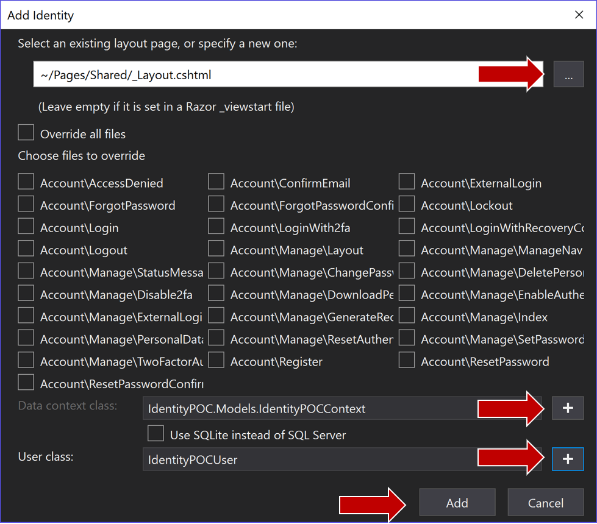

# Identity
We've discussed all kinds of high-level stuff up to now.  We talked about using an API layer in a micro-service architecture.  I think we need to take this opportunity to explore the users of all the different applications and sites.  Who are they?  What can they do?  What attributes do they have in common?  What sets them apart?  And how does that fit in with development?  Should we just use an "off the shelf" solution?  Should we roll our own?

This brings up the "build vs. buy" argument, which I'm not going to have now.  I used to be a "build it all the time, every time" kinda guy, but since the rise of Open Source Software (OSS), there are a lot of people way smarter than me that have tackled some really complex scenarios and that have made their software solutions if not easy, mostly painless to integrate into almost any solution.

Microsoft have also gotten onto the open source bandwagon and made their .net source code open source.  A nice by-product of this is that regular Joes like you and me can contribute to something that thousands of people use every day to build softare that millions of people use every day.  Pretty cool.

In researching how I wanted to handle users, I decided to use Microsoft's ASP.NET Identity Solution.  After taking <a href="https://app.pluralsight.com/library/courses/aspdotnet-core-identity-deep-dive/table-of-contents" target="_blank">Scott Brady's PluralSight course</a> on ASP.NET Identity, I think that this system will give us a great foundation upon which to build our user store.  Utilizing Entity Framework, you can even extend the Identity store with customer claims, properties, and objects.

So, what are the basic items contained in the Identity domain? If you want a detailed look at the entire domain, you can check <a href="https://docs.microsoft.com/en-us/aspnet/core/security/authentication/customize_identity_model?view=aspnetcore-2.1" target="_blank">this</a> out.  I'll borrow from that page, but only to illustrate our scenario.

What does a user represent?  They have an id surely, a way to identify them to the rest of the system.  Other properties like First Name, Last Name, and e-mail are usually good choices.  Here is what Microsoft deemed the important attributes of a user:
```csharp
Id -  //Gets or sets the primary key for this user.
UserName - //Gets or sets the user name for this user.
NormalizedUserName - //Gets or sets the normalized user name for this user.
Email - //Gets or sets the email address for this user.
NormalizedEmail - //Gets or sets the normalized email address for this user.
EmailConfirmed - // Gets or sets a flag indicating if a user has confirmed their email address.
PasswordHash - //Gets or sets a salted and hashed representation of the password for this user.
SecurityStamp - //A random value that must change whenever a users credentials change (password changed, login removed)
ConcurrencyStamp - //A random value that must change whenever a user is persisted to the store
PhoneNumber - //Gets or sets a telephone number for the user.
PhoneNumberConfirmed - //Gets or sets a flag indicating if a user has confirmed their telephone address.
TwoFactorEnabled - //Gets or sets a flag indicating if two factor authentication is enabled for this user.
LockoutEnd - //Gets or sets the date and time, in UTC, when any user lockout ends.  A value in the past means the user is not locked out.
LockoutEnabled - //Gets or sets a flag indicating if the user could be locked out.  True if the user could be locked out, otherwise false.
AccessFailedCount - //Gets or sets the number of failed login attempts for the current user.
```

Whew.  That's a lot of basic stuff in the base implementation.  But notice this: it's only what is the absolute minimum to support a basic user implementation that can support two-factor authentication.  What the developers did here was pretty smart: What are the minimum data points needed to represent a user in the context of a "connected" application or "transient connection" application?  There's e-mail, phone, user name, first and last name, password stuff and attributes about lockout settings.  I like that they included the PasswordHash property as well.

In this implementation, the primary key of Id (User Id) is a string.  I'm not sure of why an auto-incrementing value type wasn't used like an integer (maybe because integer can only reach a certain number).  For our purposes though we won't have 2 billion users.  I plan on changing this to an integer from a string.  

Before we get to that though, what else describes a typical user in any application?  How do we decide what they can and cannot do, or what functions they can perform, or even what parts of the application they can access?  

In the Identity domain, Microsoft has given us a few ways to configure this.  The concept of Roles allows us to define levels of access or levels of permission.  For example, the user is the base role that everyone fits into, but there can be users that are customers, managers, waitstaff, chefs, etc.  This allows us to set up authorization so that managers could perform certain functions that no one else can.  Chefs and waitstaff can perform certain functions, with chefs having a greater level of access (or permissions), but not as much as managers.

The next concept we can use to authorize users is that of a claim.  Think of a claim as a name/value pair that expresses something.  For example, users that have a "mobileappregistered/true" claim can do more the users who have the claim "mobileappregersted/false".

Each of these security types participates in a further way to implement Authorization: Policies.  A Policy is useful when you need to implement complex logic for authorization that a role or claim don't satisfy by themselves.

For example, let's say we wanted to give users who have registered through our mobile app and are 21 years of age or older a drink special.  We have the claim "mobileappregistered/true" with a role of "user".  But how do we epxress the age bits?  I'll get to that in a minute.  For now, let's assume there is some data structure that age is stored in.

Having all these bits of information we can come up with a policy of "mobileDrinkSpecial" that looks for the "mobileappregistered" claim as well as calculating their age based on when they registered.  We define this policy onece and can apply it anywhere in the various parts of our system we want to.  If we needed to access it from the public-facing website, we could.  As well as from the mobile app code.

As you can see, we have a very flexible system in which to store attributes of users.  There's one more way we can even add more attributes outside of roles and claims:  User Properties.

When I use the term user properties, I'm referring to other attributes you can hang off the User table.  Say birth date, Twitter handle, etc.  We just inherit from the base IdentityUser and add our own properties, or even better for larger amounts of information, we can add navigation properties to the user that point to other entities/tables.

What does all this look like in code?  Let's take a look.  For purposes of illustration and to get a basic Identity project up quickly, we are going to follow the instructions <a href="https://docs.microsoft.com/en-us/aspnet/core/security/authentication/scaffold-identity?view=aspnetcore-2.1&tabs=visual-studio" target="_blank">here</a>.  This page walks you through scaffolding Identity into your project.  We are going to follow the instructions for Scaffolding Identity into an empty project.

As an aside, another item that can contribute to how well a project goes is the development environment used to build your projects.  For proof-of-concept code, such as what we are going to use, I tend to use the full version of Visual Studio (see the Resource drop-down above).  The reason I do this is because there are all kinds of templates and extensions you can install that will get you up and running quickly and allow you to inspect the code in a structured way.  I am going to explore VS Code throughout this project as I'm attempting to "sharpen my saw" so to speak and it never hurts to learn a new tool.  Best of all, you can get free versions of both.

Visual Studio 2017 is considered a full-fledged Integrated Development Environment while VS Code sits more towards the Editor side of things.  For now, let's stick with Visual Studio 2017.

Ok, back to scaffolding our Identity code.  If you use Visual Studio 2017, this is how you spin up new web pages.  As we go through several concepts, we will spin up these throwaway projects.  I'll illustrate how to do a new project here, but after this, I'll just say "Spin up a new web project" and this is what I mean.  

* Open Visual Studio
* Click File --> New --> Project (or just use CTRL+SHIFT+N)

* Make sure you have the ASP.NET Core Web application selected.
* This is going to be throwaway code so it doesn't matter what you name it
* Choose a directory to put the project.
* Click OK

You will see a web project that has a pages directory, wwwroot directory and a bunch of supporting files.  I'm not going to go into what all those are in this post, but we will explore them in a future post.

Now we have a couple more choices to make:

* Select Web Application to make an empty Razor web page application
* Click OK and Visual Studio will whip up a sample web project:

* Choose Identity from the list on the left and then click Add

* There are a ton of options in this dialog.  Click on the + to browse to your existing layout page.
* Click on the plus signs for adding Data context class and a user class
* Click Add

After a minute or so of spinning, you will then be presented with a ScaffoldingReadMe page that will present further instructions on how to add other items like authentication to your app.

For our purposes, we are going to just look at code here.  I'm not going to explore any UI pages or flows.  I'll leave that to you, dear reader.

So, what does our project look like now?  (I promise I won't go screen capture crazy but sometimes it's good to have something to reference together.  Or at least to let you know what I'm seeing).


We are only going to concern ourselves to the classes I've singled out.

Let's take a look, starting in the Identity/Data directory.  If we open up IdentityPOCUser.cs we will see the following:
```csharp
// Add profile data for application users by adding properties to the IdentityPOCUser class
public class IdentityPOCUser : IdentityUser
{    }
```

There isn't anything there!  Notice this class inherits from IdentityUser.  That class contains all the stuff we listed up above.  We don't have to concern ourselves with managing all those "defaults".  Now we can just concern ourselves with what we need for our user.

Similarly, if we examine the IdentityPOCContext.cs file, we will see this:

```csharp
public class IdentityPOCContext : IdentityDbContext<IdentityPOCUser>
    {
        public IdentityPOCContext(DbContextOptions<IdentityPOCContext> options)
            : base(options)
        {
        }

        protected override void OnModelCreating(ModelBuilder builder)
        {
            base.OnModelCreating(builder);
            // Customize the ASP.NET Identity model and override the defaults if needed.
            // For example, you can rename the ASP.NET Identity table names and more.
            // Add your customizations after calling base.OnModelCreating(builder);
        }
    }
```

Not a lot there.  We get to concern ourselves with what we need and don't have to manage properties and tasks that every user in every application everywhere has.

If you are using ASP.NET Core 2.0 or higher, you'll notice the IdentityNostingStartUp.cs file.  This file is decorated with the [assembly HostingStartup] attribute.  This tells the WebHostBuilder when it starts building things to include this in the list.  It sets up the Identity context and adds Identity to the website.  In this file you can manage the other pieces of Identity if you want to (passwords, adding roles or role store, etc.).  This appears to just be a way to separate out that concern so your Start class isn't cluttered with Identity stuff.

Looking at the Program and StartUp classes, you'll see just a vary basic configuration of the ASP.net core environment.  I'm not going over that here.  My purpose in this post was to acquaint you with Microsoft's Identity system and show what a very basic configuration looks like.

So: should we use this as the basis of a new website?  Or should we step back and think about separation of concerns some more?  I think we need an authentication / authorization / identity management piece to be its own solution.  This piece will be responsible for authorizing users across all the applications and API endpoints, provide authorization logic for pages and api endpoints as well as application roles.

I know I said that we would discuss the attributes our users need, but I'm still thinking about that and that should probably be another post.

There was a lot to think about here.  Next time, let's think about what part of the project we want to tackle first?  Should we stay in the "cross-cutting concerns" space and think about where the data will live and how we will get access to it?  How about messaging?  Should we at least spin up a shim or placeholder project so that we can move forward with our messaging when we are ready?

We'll probably end up with a few very lean solutions / projects at first.  And then, as we flush out details, we'll start filling in the creamy goodness.

Until next time!

--Brian
